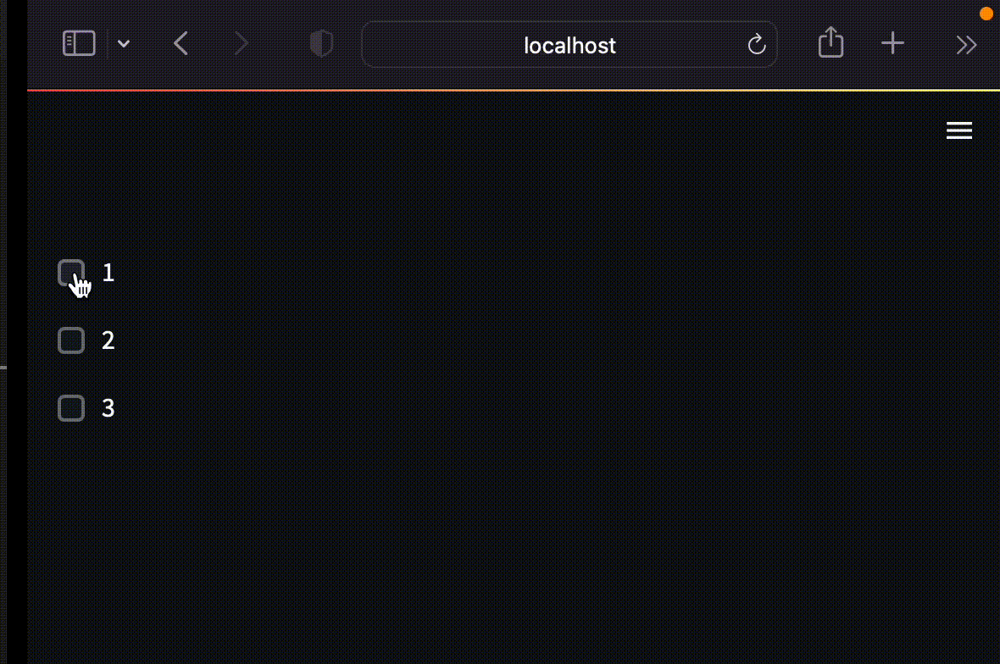

When you mark a function with Streamlit’s cache annotation, it tells Streamlit that whenever the function is called it should check three things:

1. The name of the function
2. The actual code that makes up the body of the function
3. The input parameters that you called the function with

If this is the first time Streamlit has seen those three items, with those exact values, and in that exact combination, it runs the function and stores the result in a local cache.

Then, next time the function is called, if those three values have not changed Streamlit knows it can skip executing the function altogether. Instead, it just reads the output from the local cache and passes it on to the caller.

