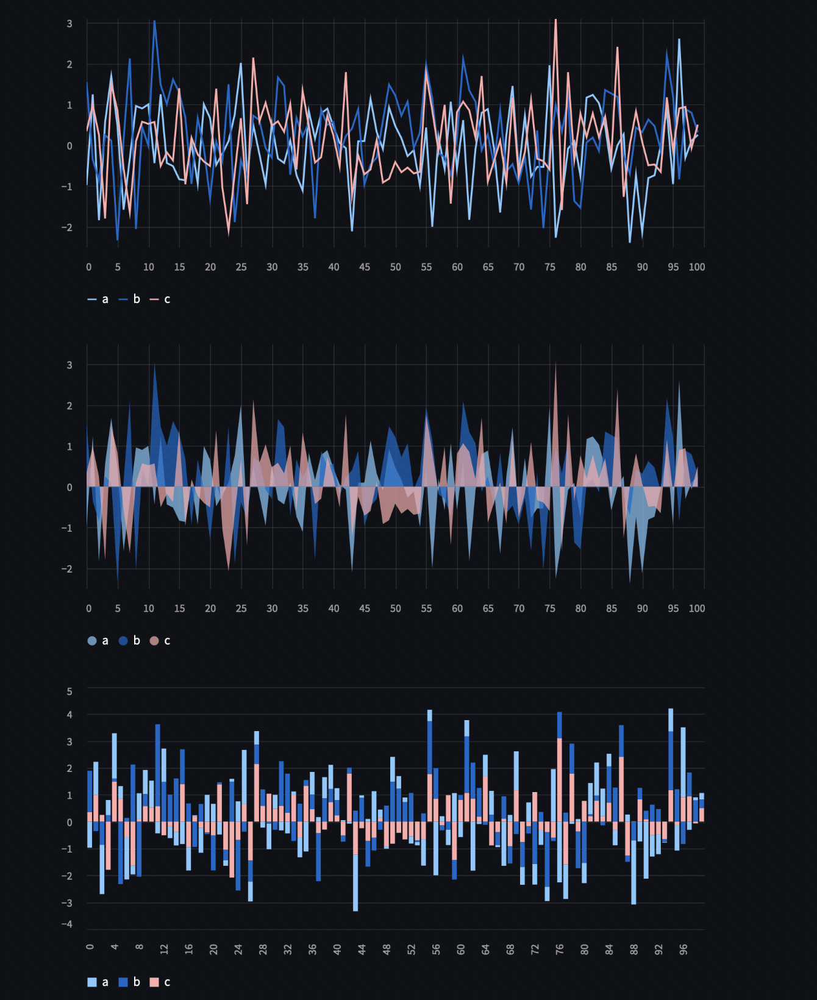
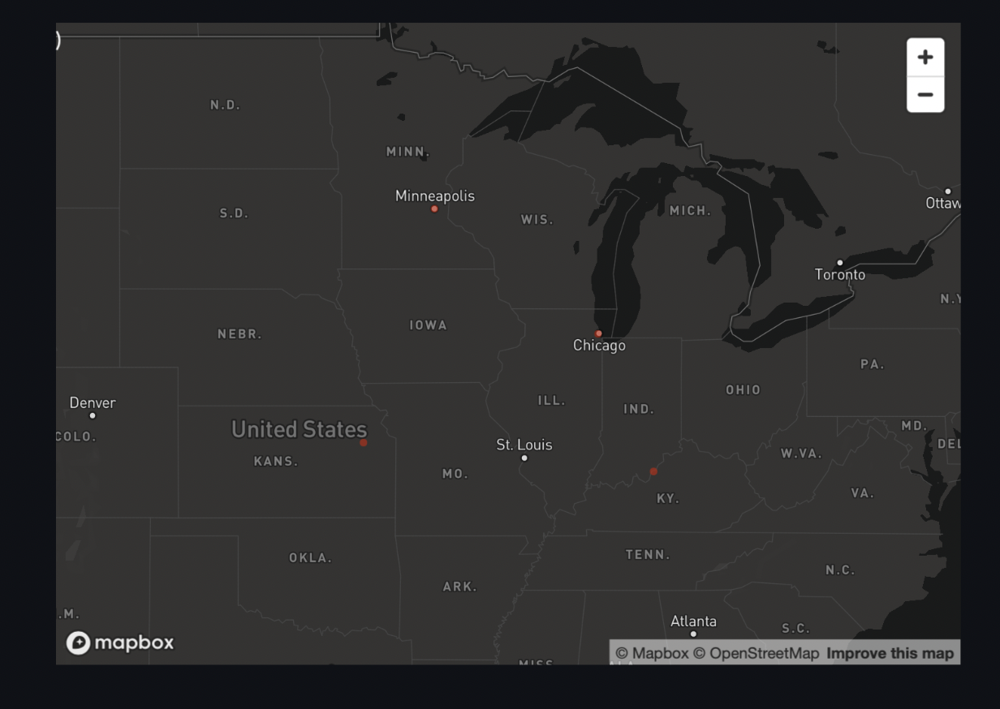

### Ploting data
- st.line_chart, st.area_chart, st.bar_char
- st.pyplot
    - works with matplotlib.pyplot
- st.altair_chart
    - works with altair module

### Di graph
st.graphviz_chart

#### Map
st.map
- takes latitude, longitude value of city which is to be plotted.
- when no parameter is passed, center of world map is shown.

